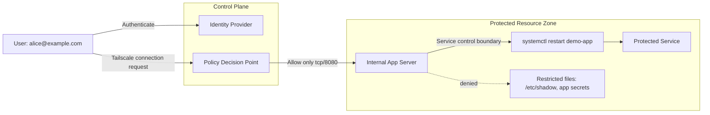

# Zero Trust & Identity Lab Guide

## Learning Objectives

After completing this lab, you should be able to:
- Explain how Zero Trust differs from perimeter security
- Implement identity-based access control using Tailscale ACLs
- Enforce least privilege with Linux sudoers policies
- Use an LLM to summarize and investigate authentication logs

## Lab Overview

This lab introduces zero trust using identity as the primary control point. The examples align conceptually with NIST SP 800-207:

- Verify explicitly.
- Enforce least-privilege access.
- Assume breach and rely on continuous validation.

You will work through three practical examples:

1. An identity-based network access rule in Tailscale
2. A narrowly scoped Linux `sudoers` policy
3. An LLM-assisted review of `auth.log`

## Scenario

You are designing and validating a hands-on lab for a Junior Security Analyst. The goal is to show the shift from traditional perimeter trust to Zero Trust Architecture by using identity-aware connectivity, narrow authorization, and continuous log review.

## Milestones

By the end of the lab, the learner should have completed these four milestones:

1. Identity-centric connectivity: move from IP-based assumptions to identity-based access.
2. Micro-segmentation: allow only a specific service on port `8080` while blocking other lateral movement.
3. Principle of least privilege: configure a `Junior Admin` role that can restart one service but cannot read sensitive files.
4. Generative AI integration: use an LLM to summarize and investigate `auth.log` activity and explain likely violations.

## Estimated Time

About 2 hours total.

## Before You Begin

Have the following available if you want to try the examples hands-on:

- A Linux machine or VM
- Access to `sudo`
- Optional test service such as `nginx` or `apache2`
- Optional Tailscale test tailnet

## Section 1: Zero Trust in Plain Language

In a perimeter model, being on the corporate network often implies trust. In a zero trust model, access decisions are based on policy, identity, device posture, and context for every request.

NIST SP 800-207 does not say "trust nobody" in a simplistic way. It says trust should be limited, continuously evaluated, and tied to policy enforcement points.

### Key Ideas to Keep in Mind

- Identity is central. Users and services should be authenticated before access is granted.
- Access should be as narrow as possible. If an app listens on port `8080`, access to port `22` should not be implied.
- Administrative power should be task-scoped. Restarting a service is not the same as being full root.
- Logs matter because you should assume an attacker may already have some foothold.

### Check Your Understanding

1. Why is network location alone a weak access decision?
2. What does "assume breach" change about day-to-day operations?
3. How is least privilege different from simply using passwords?

## Section 2: Trust Boundaries

Zero trust designs depend on understanding where trust changes. In this small lab, the main trust boundaries are:

- User identity proving who is making the request
- Device and network path connecting to the application
- Policy engine deciding whether access is allowed
- Linux privilege boundary between a normal user and root-level actions

### Trust-Boundary Diagram

If your local Jekyll preview does not render Mermaid, use the fallback image directly below the code block. Both versions show the same trust-boundary idea: identity is verified first, access is narrowed by policy, and sensitive files remain behind a separate privilege boundary.

Tip: If you are teaching this lab live, walk through the diagram before any commands. Beginners usually understand the later ACL and `sudoers` steps more quickly once they can point to the trust boundaries.

## Lab Architecture

This lab models a simple Zero Trust environment where identity is verified
before access to a protected service is granted.

Components:

- Identity Provider (GitHub / Google SSO)
- Tailscale mesh network
- Internal application server
- Linux privilege boundary enforced via sudoers
- Authentication logs analyzed with an LLM




*Figure: Static fallback for the trust-boundary diagram in case Mermaid does not render in the local or hosted Jekyll view.*

### What the Diagram Shows

- Authentication and authorization are separate from network location.
- The policy decision point allows only one narrow path: the app on port `8080`.
- Even on the target host, a junior admin role should not automatically gain access to sensitive files.

### Check Your Understanding

1. Which component acts like a policy decision point in this example?
2. Why is port-level restriction useful even after identity has been verified?
3. What is the trust boundary between `systemctl restart demo-app` and `/etc/shadow`?

## Section 3: Identity-Aware Access with Tailscale ACLs

In zero trust, an authenticated identity receives only the access it needs. The sample policy below demonstrates that principle by allowing one identity to reach one destination on one port.

Open [resources/tailscale-acl-example.json]({{ '/resources/tailscale-acl-example.json' | relative_url }}).

### Example Goal

Allow only `junior.admin@example.com` to access `app-server` on TCP port `8080`.

### Why This Matters

This is a direct expression of least privilege:

- One identity
- One device or tagged resource
- One port
- No implied administrative shell access

### Walkthrough

1. Locate the `src` field. This is the identity or group making the request.
2. Locate the `dst` field. This defines the allowed destination and port combination.
3. Confirm there is no access to `22`, `443`, or wildcard ports.
4. Ask whether this rule should depend on group membership instead of an individual user as the environment grows.
5. Consider device posture or approval workflows as future controls, but keep this lab focused on identity and port restriction.

### Identity Setup with SSO/OIDC

Before you test the ACL, sign in to Tailscale with an identity provider such as GitHub or Google. This matters because the policy is not based on IP address alone. It is based on who the user is, which is a core Zero Trust idea from NIST SP 800-207.

If you are using a fresh test environment:

1. Create or use a Tailscale account backed by GitHub or Google SSO.
2. Sign in to the Tailscale client on the learner device with that identity.
3. Confirm that the signed-in user matches the identity referenced in the ACL, such as `junior.admin@example.com`.
4. Confirm that the destination server is also connected to the same tailnet and tagged as `tag:app-server`.

Interpretation: once the learner and the destination server are both in the tailnet, access decisions can be made by identity and policy rather than by network location alone.

Tip: If your test identity name does not exactly match `junior.admin@example.com`, update the sample ACL before testing. A mismatch here will look like a policy failure even when the tailnet is working correctly.

### Hands-On Steps

In the commands below, `app-server` refers to the destination host or tagged device used in the ACL example, as shown by `tag:app-server:8080` in the policy file. The exact commands depend on your test environment, but the pattern below is what you should verify.

#### Step 1: Open the policy file and review the allow rule

Start by confirming which identity is allowed and which destination and port are in scope.

```bash
cat resources/tailscale-acl-example.json
```

Expected result:

```text
"src": ["junior.admin@example.com"]
"dst": ["tag:app-server:8080"]
```

#### Step 2: Confirm the demo app is listening on port `8080`

This checks that the destination host is actually serving the application on the same port the ACL allows.

```bash
ss -tulpn | grep 8080
```

Expected result:

```text
LISTEN 0 128 0.0.0.0:8080 ...
```

#### Step 3: Test the allowed access path

Run this from the device signed in as the allowed identity to verify that the permitted application path works.

```bash
curl -I http://app-server:8080
```

Expected result:

```text
HTTP/1.1 200 OK
```

#### Step 4: Test a denied access path such as SSH on port `22`

Use the same identity and destination, but change the port to something not included in the ACL.

```bash
nc -vz app-server 22
```

Expected result:

```text
nc: connectx to app-server port 22 ... failed: Operation timed out
```

#### Step 5: Optionally test access from an unlisted identity

If you have a second user that is not included in the policy, retry the allowed application port from that identity to confirm it is blocked.

Expected result:

```text
Connection failed or access denied
```

These checks verify both identity-based access control and micro-segmentation: the right user can reach the right service on the right port, and nothing broader is implied.

Tip: The important signal is not the exact error string. The important signal is that the unauthorized port or identity does not get application access.

### Explicit Allow/Deny Verification

- Allowed: `junior.admin@example.com` can reach `app-server:8080`
- Denied: `junior.admin@example.com` cannot reach `app-server:22`
- Denied: an unlisted identity cannot reach `app-server:8080`

This is a small but concrete zero trust policy: identity plus destination plus port, with no broad network trust.

### Beginner Notes

- Tailscale ACLs are JSON policy documents.
- The `acls` list contains permit rules.
- A narrow rule is easier to review and safer to audit than a broad allow-all rule.

### Check Your Understanding

1. What exactly is being allowed in this policy?
2. What would change if the destination were `app-server:*` instead of `app-server:8080`?
3. Why might a group-based rule be better than a single-user rule in production?

## Section 4: Linux Least Privilege with `sudoers`

Zero trust is not only about network access. It also applies inside the host. A junior operator may need to restart a service without being able to read secrets or gain full administrative control.

The goal of this exercise is to create a restricted operational role that can restart one service, but cannot read sensitive files or gain full root privileges. This is a practical example of least privilege inside the server, not just at the network edge.

Open [resources/junior-admin.sudoers]({{ '/resources/junior-admin.sudoers' | relative_url }}).

### Example Goal

Permit members of the `junioradmin` group to restart exactly one service, `demo-app`, using `systemctl`, while preventing general root access.

### Walkthrough

1. Create a dedicated group such as `junioradmin`.
2. Add the intended learner account to that group.
3. Review the `Cmnd_Alias` entry. It allows only one exact command path and action.
4. Review the group rule. It grants `NOPASSWD` for that one alias only.
5. Validate that users in the role cannot run `sudo cat /etc/shadow`.
6. Validate that users in the role cannot run arbitrary shell commands through `sudo`.

### Hands-On Tutorial

#### Step 1: Create a restricted operational role

This step creates a dedicated group and user for a junior administrator. In Zero Trust, administrative access should be role-based and limited to the minimum task required, rather than granted through broad root access.

```bash
sudo groupadd junioradmin
sudo useradd -m -G junioradmin junioradmin
sudo tee /etc/systemd/system/demo-app.service > /dev/null <<'EOF'
[Unit]
Description=Demo App

[Service]
ExecStart=/usr/bin/python3 -m http.server 8080
Restart=always

[Install]
WantedBy=multi-user.target
EOF
sudo systemctl daemon-reload
sudo systemctl enable --now demo-app.service
sudo cp resources/junior-admin.sudoers /etc/sudoers.d/junior-admin
sudo visudo -cf /etc/sudoers.d/junior-admin
```

Expected result:

```text
/etc/sudoers.d/junior-admin: parsed OK
```

Interpretation: you now have a dedicated role, a harmless service to manage, and a validated `sudoers` policy that permits only one specific administrative action.

Tip: Always validate `sudoers` syntax with `visudo -cf` before enabling a new policy. A syntax mistake in `sudoers` can lock you out of administrative access.

#### Step 2: Test the one action that should be allowed

Now switch into the restricted role and run the exact command the policy is designed to allow. This proves that the user can perform the operational task they need without being made a general administrator.

```bash
su - junioradmin
sudo /bin/systemctl restart demo-app.service
```

Expected result:

```text
<no error output>
```

Interpretation: the lack of an error means the policy allowed the exact restart action defined in the `Cmnd_Alias`.

#### Step 3: Verify the service is still running

After a successful restart, confirm that the target service is healthy. This is the operational proof that least privilege still allows the intended business task to complete.

Confirm the service is healthy:

```bash
systemctl status demo-app.service --no-pager
```

Expected result:

```text
Active: active (running)
```

Interpretation: the service restarted successfully, so the restricted role is useful without being over-privileged.

#### Step 4: Prove that sensitive file access is denied

Least privilege is only meaningful if forbidden actions are actually blocked. This test checks that the junior admin role cannot use `sudo` to read a sensitive system file.

The same role should fail when attempting to read sensitive files:

```bash
sudo /bin/cat /etc/shadow
```

Expected result:

```text
Sorry, user junioradmin is not allowed to execute '/bin/cat /etc/shadow' as root ...
```

Interpretation: the account is authenticated, but it is not trusted with unrestricted root-level file access.

#### Step 5: Prove that full root access is denied

The next test confirms that the role cannot escape the policy by opening a root shell. In Zero Trust terms, the user is allowed one approved operation, not broad administrative authority.

It should also fail for a root shell:

```bash
sudo -s
```

Expected result:

```text
Sorry, user junioradmin is not allowed to execute '/bin/zsh' as root ...
```

Interpretation: the policy prevents privilege expansion beyond the single approved command.

### Explicit Allow/Deny Verification

- Allowed: `sudo /bin/systemctl restart demo-app.service`
- Denied: `sudo /bin/cat /etc/shadow`
- Denied: `sudo -s`
- Denied: `sudo /bin/systemctl restart sshd.service`

### Why This Aligns with Zero Trust

- The user is authenticated but still not broadly trusted.
- The action is policy-defined and explicit.
- Access is limited to the minimum operational task.
- Sensitive files remain protected behind another trust boundary.

### Safe Test Ideas

If you have a lab VM:

1. Create a test service or use an existing harmless service such as `nginx`.
2. Replace `demo-app.service` with the test service name if needed.
3. Use `visudo -cf /etc/sudoers.d/junior-admin` to validate syntax before enabling the rule.
4. Test both allowed and denied commands.

By completing the allow and deny tests, you have shown that the role can do one specific operational job and nothing more. That is the key result of this section: the system trusts the action defined by policy, not the user with blanket root privileges.

### Check Your Understanding

1. Why is a command alias safer than broad `ALL=(ALL) NOPASSWD: ALL` access?
2. Why should exact command paths be used in `sudoers`?
3. How does this example support least privilege inside the server?

## Section 5: Using an LLM as a Security Co-Pilot for `auth.log`

An LLM can help summarize authentication events, detect patterns, and draft investigation questions. It should not replace human review, and it should not receive secrets or sensitive data without approval.

Open [resources/sample-auth.log]({{ '/resources/sample-auth.log' | relative_url }}).

### What an LLM Is Good At

- Summarizing repeated failed login attempts
- Identifying possible brute-force patterns
- Extracting timestamps, usernames, and source IPs
- Turning raw logs into a concise incident summary
- Suggesting next investigation steps

### What the Human Must Still Do

- Verify whether events are real threats or benign admin activity
- Correlate with asset inventory, IAM records, and change windows
- Confirm whether the source IP is known or malicious
- Decide whether to lock accounts, block access, or escalate

### Safe Workflow

1. Start with a small log excerpt rather than the entire file.
2. Remove secrets, internal tokens, or unnecessary personal data.
3. Ask the model for summary, timeline, anomalies, and confidence levels.
4. Cross-check the model's output against the original log lines.
5. Record the final analyst conclusion yourself.

Tip: Treat the LLM as an analyst assistant, not as the final authority. It can speed up triage, but you still need to verify the conclusion against the raw log evidence.

### Hands-On Steps

Start by reading the sample log yourself:

```bash
cat resources/sample-auth.log
```

Then isolate only the authentication failures:

```bash
grep "Failed password\\|Accepted publickey\\|user NOT in sudoers\\|COMMAND=" resources/sample-auth.log
```

Expected result:

```text
Mar 14 09:11:02 ... Failed password ...
Mar 14 09:11:05 ... Failed password ...
Mar 14 09:11:08 ... Failed password ...
Mar 14 09:16:41 ... COMMAND=/bin/systemctl restart demo-app.service
Mar 14 09:18:10 ... user NOT in sudoers ... COMMAND=/bin/cat /etc/shadow
Mar 14 09:20:33 ... Accepted publickey for devops ...
Mar 14 09:21:02 ... COMMAND=/usr/bin/journalctl -u demo-app
```

Create a quick manual timeline:

```bash
nl -ba resources/sample-auth.log
```

You should be able to identify:

- repeated SSH failures from `203.0.113.24`
- one allowed `sudo` action by `junioradmin`
- one denied attempt to read `/etc/shadow`
- one successful login by `devops`

### Example LLM Workflow

Paste only the small excerpt you need, then ask:

```text
Summarize this auth.log excerpt. Group events by source IP and username, identify any suspicious sequence, and clearly separate observed facts from hypotheses.
```

Expected analyst-quality output:

- Facts: three failed SSH logins from `203.0.113.24`
- Facts: `junioradmin` successfully restarted `demo-app.service`
- Facts: `junioradmin` was denied when trying to read `/etc/shadow`
- Facts: `devops` logged in via public key
- Hypothesis: the repeated failed logins may indicate password guessing and should be correlated with firewall and identity records

### Explicit Verification Steps

After using the model, confirm the following manually in the source log:

1. The failed logins are all from the same source IP.
2. The denied `sudo` command targeted a sensitive file.
3. The successful `sudo` command matches the narrow `sudoers` policy.
4. The LLM did not invent a successful compromise that is not present in the logs.

### Example Prompts

Prompt 1:

```text
Analyze this auth.log excerpt. Summarize failed and successful login events, identify suspicious patterns, and list the top 3 follow-up questions. Do not assume a breach unless the log supports it.
```

Prompt 2:

```text
Create a timeline from these log lines. Group events by source IP and username, then flag any likely brute-force or privilege-escalation attempts.
```

### Beginner Exercise

1. Read the sample log manually first.
2. Write down what you think happened.
3. Then use an LLM to produce a summary.
4. Compare the two and note what the model caught, missed, or overstated.

### Check Your Understanding

1. Why should you minimize the amount of log data pasted into an LLM?
2. Why is LLM output a starting point rather than a final incident decision?
3. Which fields in `auth.log` are most useful for spotting a brute-force pattern?

## Section 6: Wrap-Up

You have now applied core zero trust ideas across three layers:

- Network access was restricted by identity and port.
- Host privilege was restricted by exact administrative task.
- Ongoing monitoring used logs and analysis rather than implicit trust.

This is the practical spirit of NIST SP 800-207: policy-based access, continuous verification, and minimized trust.

## Final Review Questions

1. How did identity appear in each of the three examples?
2. Which example best demonstrates least privilege, and why?
3. What are the risks of broad exceptions in ACLs or `sudoers`?
4. If this lab were extended, what extra context would you add to access decisions: device posture, time, location, or behavior?

## Optional Next Steps

- Replace single-user ACLs with groups.
- Add MFA and device posture requirements.
- Extend log review with SSH key activity and service account events.
- Add a simple architecture review for another internal application.
